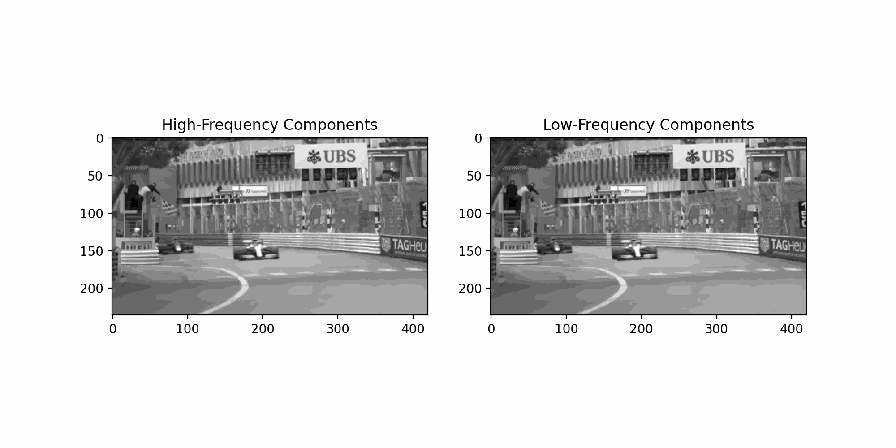

- [Dynamic_Mode_Decomposition](#Dynamic_Mode_Decomposition)
- [Hopping](#Hopping)
- [Fourier](#Fourier)
- [Rcnn-Pinns](#Rcnn_Pinns)
- [Donut](#Donut)
- [Middle States](#middle-states)

# Just_For_Fun
Here’s a collection of fun projects—some might be failed experiments, while some result in interesting creations. 

## Dynamic_Mode_Decomposition
This project implements Dynamic Mode Decomposition (DMD) on a movie dataset to separate and visualize the high and low-frequency components of the video. Which demonstrates a powerful technique for analyzing time-series or spatiotemporal data.

## Hopping

## Fourier
Fourier method simulate heat equation

## Rcnn_Pinns
(Failed Experiment)
This project originally used an RCNN architecture to simulate the 2D heat equation, but the results were "sehr schlechte". The architecture was then rebuilt using a CNN structure, but the outcomes are still disappointing. I might revisit and reconstruct it when a new idea strikes.

## Donut
an example of Projection (rendering issue)

## Middle States
